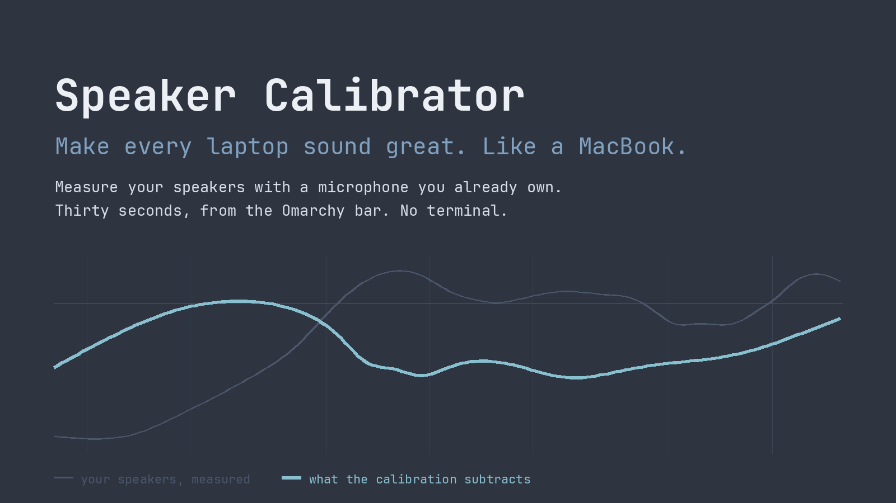
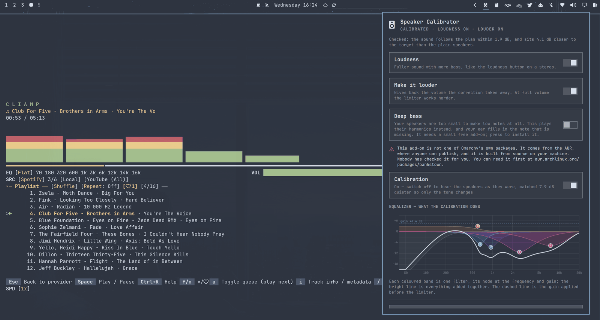

# Omarchy Speaker Calibrator

**Measure your speakers with a microphone. Get them to sound the way they
should. In about thirty seconds, from the Omarchy bar.**



Laptop speakers have peaks and dips of ten decibels or more, and no two
machines are wrong in the same way. This measures yours with a microphone you
already own, works out what to subtract, and installs a PipeWire filter that
does it. Everything happens in the panel. Nothing needs a terminal.

## Install

```bash
omarchy plugin add https://github.com/thefreshoffice/omarchy-speaker-calibrator.git --enable
```

That is the whole installation. Omarchy asks where to put the bar widget.

Measuring needs `python-numpy` and `python-scipy`, which Omarchy does not
ship. The panel notices and offers to install them in one press, from
Omarchy's own packages. The filter itself uses `lsp-plugins-lv2`, which
Omarchy already ships.

## Using it

1. **Click the speaker icon** in the bar.
2. **Press Calibrate speakers.** Your built-in speakers and microphones are
   already selected.
3. **Be quiet for about thirty seconds.** You will hear six sweeps: three per
   speaker.
4. **That is it.** If the measurement passes its quality checks it installs
   itself and you are listening to the result.



Middle-click the bar icon to re-scan for devices. If a measurement fails a
quality gate it is kept for diagnosis but never installed, so a bad
measurement cannot make your speakers worse.

### The four switches

| Switch | What it does |
| --- | --- |
| **Loudness** | Fuller sound with more bass, like the loudness button on a stereo. |
| **Make it louder** | Gives back the volume the correction takes away. The limiter works harder at full volume. |
| **Deep bass** | Suggests low notes the speakers cannot physically play, using their harmonics. Needs one optional package. |
| **Calibration** | Switch it off to hear the plain speakers, level-matched so only the tone changes. |

Everything else lives under **Advanced**: voicing, the three loudness levels,
channel balance, loudness compensation, the measurement details, and a
comparison of what each microphone measured.

## Deep bass needs one optional package

Everything above runs on what Omarchy ships. **Deep bass** is the exception.
It needs a free package called `bankstown`, and it is not installed unless you
press the button that installs it.

The reason it is optional is that `bankstown` is not one of Omarchy's curated
packages. It comes from the Arch User Repository, where anyone can publish,
and it is built from source on your machine rather than installed as a
reviewed binary. That is a judgement about software you install, so the plugin
does not make it for you. The panel tells you where it comes from before it
does anything, and you can read
[the upstream source](https://github.com/chadmed/bankstown) first.

Leave it alone and the calibration is complete and unaffected.

### Why it works

Small speakers cannot move enough air to make a low note at all. Rather than
asking them to try, Deep bass plays the harmonics of those notes, which the
speakers can produce, and the ear supplies the fundamental it never heard.

A note is not only its fundamental. A bass guitar playing a 55 Hz note also
radiates energy at 110, 165 and 220 Hz, and the ear works out the pitch from
the spacing of that series rather than from the presence of the lowest tone.
Remove the fundamental entirely and the pitch does not change: only a 55 Hz
note produces harmonics spaced 55 Hz apart. This is the missing fundamental,
described by Seebeck in 1841, and it is why a telephone limited to 300 Hz and
above still carries a voice whose fundamental is near 100 Hz.

## How it works

### Measuring

Three exponential sine sweeps per speaker, left and right measured
independently. The analyzer deconvolves the response, finds the direct sound,
and reads the magnitude through a window of fifteen cycles: 150 ms at 100 Hz,
15 ms at 1 kHz, 1.5 ms at 10 kHz. That keeps the desk reflection you also
hear while dropping later room reflections, so the filters are fitted to the
speaker rather than to the room around the microphone.

The room between sweeps is put through the identical deconvolution to measure
the noise floor at every frequency. The resulting signal-to-noise ratio widens
the optimizer's uncertainty wherever the floor is close, which on small
speakers is mostly the bass. Clock drift between playback and recording is
estimated and corrected. Clipping, sweep prominence, alignment, repeatability,
microphone gain stability and harmonic residuals are all checked.

When a built-in microphone array offers two or more channels, every channel is
analyzed independently and their raw recordings are never mixed. The responses
are combined with a robust median, and disagreement between microphones is
added to the uncertainty curve, which suppresses risky corrections.

### Fitting

Cuts are the normal solution. The optimizer penalises boosts more than ten
times as strongly, and every filter is cross-validated against a held-out
repeat of the measurement, so a correction has to improve a sweep it was not
fitted to before it is kept.

Smoothing follows the ear's own resolution rather than a fixed fraction of an
octave, and weights peaks over dips: a resonance is audible and worth
removing, while a cancellation of the same depth is usually a null at the
microphone that moves when your head does.

A protective high-pass goes where the measurement says the speaker gives up,
and everything is fitted above that.

### Checking the result

**Check the calibration** replays the sweeps through the installed filter and
measures what actually comes out. It reports how closely the sound follows the
plan and whether it sits closer to the target than the plain speakers did. The
deep-bass add-on is muted during a check, because it invents harmonics no
linear model predicts and would otherwise read as error.

**Improve from the check** feeds that residual back in and fits again, using
the same gates. It is level-neutral, so iterating never drifts the overall
loudness.

## Advanced

**Flat or Warm.** Flat is balanced with more clarity. Warm is softer and less
sharp for long listening. Both are voicings of the same measurement.

**Loudness: Protected, Balanced, Matched.** How much of the loudness the cuts
removed is added back as input gain: none, half, or all of it up to 6 dB.
Matched is the loudest and makes the limiter work hardest.

**Bass: Normal or Full.** Full adds a +3 dB low shelf placed clear of the
high-pass corner, paid for by input trim like any boost.

**Channel balance** trims a broadband level difference between the two
speakers, which pulls the stereo image off centre. It only ever acts on a
measurement made with an external microphone at the listening position, only
when the difference stands clear of what the measurement itself varies by, and
only by turning the louder side down. A built-in array sits closer to one
speaker than the other, so what it measures is where it is rather than what
reaches you.

**Loudness compensation** follows the volume and puts back what hearing drops
as the level falls, using the ISO 226:2023 equal-loudness curves. Full volume
is the reference: it does nothing there and more the further down you play.
The loudness stays the same either way; only the tone moves. It is the one
part of this that needs something running in the background, because only the
output device knows the listening level.

### Which microphones can measure

The list offers real capture devices and nothing else. A Bluetooth headset
appears on the system as a microphone, but its input runs over HFP or HSP:
mono, eight to sixteen kilohertz, with automatic gain and noise suppression
applied inside the headset. It cannot describe a loudspeaker, and a
calibration fitted to one would be correcting for the headset. Those are named
in the panel as connected but unusable rather than quietly dropped.

### Comparing the two microphones

Advanced keeps the last measurement from each kind of microphone and draws
them on one set of axes, levelled on the 250 Hz to 1 kHz band so you see the
difference in shape rather than in sensitivity, with the difference read out
by band underneath.

This is the honest answer to whether an external microphone is worth it. A
built-in array sits inside the case, inches from one driver and behind
whatever the lid is made of. A measuring microphone sits where your head is.
Where the two curves disagree, the built-in one is describing its own position
rather than the sound that reaches you.

Only the curve is kept, a few kilobytes, never the recording.

## Safety model

The whole point is that a bad measurement cannot damage anything or make the
sound worse than it started.

- One filter section may cut at most 12 dB, and the whole correction is held
  to -15 dB at any frequency. With an uncalibrated built-in microphone the
  limit tightens by frequency: -6 dB at 160 Hz, -8 dB at 10 kHz, the full
  -15 dB only in the reliable midrange.
- Boosts are spent from a budget, not merely capped. Every decibel is
  electrical headroom the limiter must be given back, which is the same
  headroom **Make it louder** would otherwise return, and it is also cone
  travel: for the same pressure a driver moves four times as far an octave
  lower. Each decibel is priced by the inverse square of frequency, measured
  from where *this* speaker gives up. The same 4 dB dip at 260 Hz earns
  0.31 dB on a laptop whose knee is at 196 Hz and the full 1.5 dB on speakers
  measured down to 55 Hz. What it cost is recorded in the profile.
- The protective high-pass goes at the highest frequency below 400 Hz where
  the speaker falls more than 15 dB short of its target, clamped to between 50
  and 200 Hz. Below that the cone still travels as far as ever while producing
  almost nothing, so the content is removed rather than amplified. The slope
  doubles only when the corner is at or below 100 Hz, where a steep filter
  cannot be heard. The high-pass is added to the target too, so the optimizer
  never spends filters boosting back what was deliberately removed.
- Every positive correction is matched by automatic input trim plus 1 dB of
  margin, so no band is ever driven more than 5 dB harder than the uncorrected
  speaker at the same volume setting. The limiter ceiling stays at -1 dBFS,
  with auto-level and boost disabled.
- Switching the calibration off level-matches the plain speakers to the
  loudness the correction plays at, so the comparison is about tone rather
  than volume. It only ever turns the plain sound down, never up.
- A measurement is always taken with the correction flattened, so the plugin
  can never fit a correction on top of itself.
- The filter graph always has the same shape, so installing or comparing
  profiles updates its controls rather than restarting the audio client.
- Existing tuning files are backed up before replacement, and failed or
  clipped measurements are saved for diagnosis but cannot be installed.

## What leaves your machine

Nothing. There is no API, no telemetry, no update check and no account. The
plugin never opens a socket.

The one exception is the optional `bankstown` package, and only if you press
the button that installs it, which hands the work to Omarchy's package tooling.

The microphone is opened only while a measurement is running. The recordings
stay on disk under `~/.local/share/omarchy-speaker-calibrator/` and are never
uploaded.

## Removing it

```bash
omarchy plugin remove thefreshoffice.speaker-calibrator
```

Press **Disable** in the panel first. That restores the default output, stops
both services and takes the filter out of the audio path. If the plugin is
removed while a calibration is still active, the PipeWire filter keeps running
from the files below until they are deleted or the machine restarts, and the
panel is no longer there to switch it off.

Removing the plugin deletes its own directory and nothing else. These are
created outside it and stay behind:

| Path | What it is |
| --- | --- |
| `~/.config/systemd/user/omarchy-speaker-tuning.service` | runs the filter graph |
| `~/.config/systemd/user/omarchy-speaker-loudness.service` | follows the volume for loudness compensation |
| `~/.config/pipewire/omarchy-speaker-tuning.conf` | the filter sink |
| `~/.config/pipewire/omarchy-speaker-tuning.conf.d/90-tuning.conf` | the measured filters |
| `~/.local/share/omarchy-speaker-calibrator/` | profiles, checks, and the recorded sweeps |

Those recordings are audio captured in your room by your microphone. Nothing
is ever sent anywhere, but they survive removal until deleted.

To remove all of it after disabling:

```bash
systemctl --user disable --now omarchy-speaker-tuning.service omarchy-speaker-loudness.service
rm -f ~/.config/systemd/user/omarchy-speaker-tuning.service \
      ~/.config/systemd/user/omarchy-speaker-loudness.service \
      ~/.config/pipewire/omarchy-speaker-tuning.conf \
      ~/.config/pipewire/omarchy-speaker-tuning.conf.d/90-tuning.conf
systemctl --user daemon-reload
rm -rf ~/.local/share/omarchy-speaker-calibrator
```

If you installed `bankstown` it is a normal system package and is left alone.
Remove it with `pacman -R bankstown` if you want it gone.

## Runtime dependencies

| Package | Ships with Omarchy | Needed for |
| --- | --- | --- |
| `pipewire` | yes | everything |
| `lsp-plugins-lv2` | yes | the filter chain, the limiter, loudness compensation |
| `python-numpy` | no | measuring |
| `python-scipy` | no | measuring |
| `bankstown` | no, and it is from the AUR | the optional Deep bass switch |

Only measuring waits on the two Omarchy does not ship, and the panel offers to
install them itself. The plugin uses Arch's system Python so its DSP
environment is deterministic even when another Python is first on `PATH`.

## Research basis

The target curve follows the in-room response listeners prefer in controlled
tests (Olive, Welti and McMullin), which slopes gently down rather than being
flat. Fixing peaks while leaving dips largely alone follows Toole and
Välimäki: a resonance is a property of the speaker, while a deep null is
usually interference that moves with your head. Smoothing follows the ear's
critical bandwidth rather than a fixed fraction of an octave. Loudness
compensation uses the ISO 226:2023 equal-loudness contours, and Deep bass
relies on the missing fundamental, first described by Seebeck in 1841.

## Licence

MIT.
